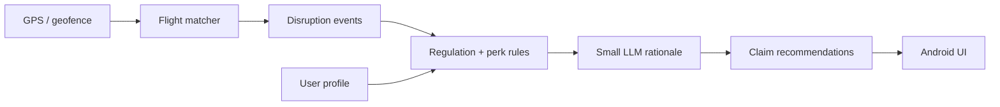

# AeroDue

Offline-first travel disruption compensation assistant. Tracks your location and flights, maps delays and cancellations to **DOT/EC261-style regulations**, **credit card trip protection**, **business travel policies**, and **airline loyalty perks**, then surfaces eligible refunds and claims.

## Repository layout

| Path | Role |
|------|------|
| [`android/`](android/) | Pixel 8 client — signup, profile, carriers, CC plans, claim review UI |
| [`backend/`](backend/) | Host reference — regulation corpus, CLI, parity tests |
| [`android/core/`](android/core/) | On-device compensation engine (Kotlin) |

The Android app runs a **native Kotlin engine** (`android/core/`). The Python `backend/` package is for host-side regulation ingestion, CLI, and parity testing — not bundled in the APK.

## On-device model target

Primary candidates (≤ ~2GB quantized for Pixel 8):

- **Qwen2.5-0.5B-Instruct** or **Qwen2.5-1.5B-Instruct** (4-bit GGUF / MediaPipe)
- **SmolLM2-360M-Instruct** (lighter fallback)

The LLM interprets unstructured policy text; deterministic rules in `android/core` (mirrored in `backend/` for host dev) produce final eligibility and amounts.

## Data flow (offline)



## Getting started

- **Backend (dev):** see [backend/README.md](backend/README.md)
- **Android toolchain (SDK, NDK):**
  ```bash
  ./scripts/setup-android-env.sh
  source .env.android
  ./scripts/verify-android-env.sh
  ```
- **On-device model (optional):** `./scripts/download-models.sh`
- **Android build:** `cd android && ./gradlew :app:assembleDebug` (or open in Android Studio Ladybug+)
- **Agents / host Python workflow:** see [AGENTS.md](AGENTS.md)

## Status

Early scaffold — domain models and UI shells are in place; regulation corpus and bundled models are not yet shipped.
