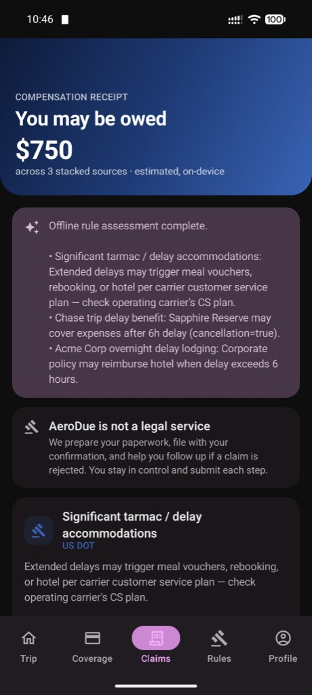
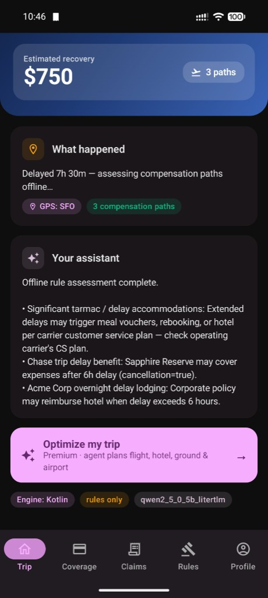
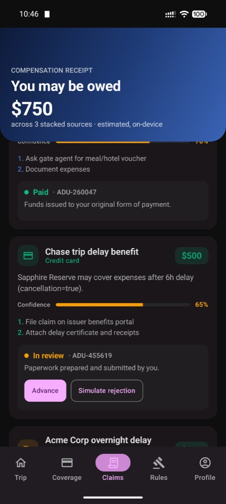
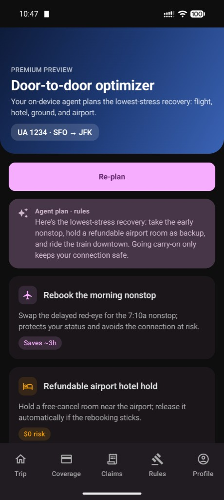

# AeroDue

**Get paid when your flight falls apart** — privacy-first, on-device compensation recovery.

> **Built with [Cursor](https://cursor.com) at the Cursor hackathon.** We shipped a working Android app end-to-end in one session: Kotlin rules engine, Jetpack Compose UI, on-device Qwen via LiteRT-LM, MCP connectors, and filing flows — with agents exploring the repo, implementing module-by-module, and keeping `android/core` aligned with the Python parity backend. See the [technical deck](docs/tech.html) for how we used Cursor as the factory floor.

**Product name in the app:** *Comped* (this repo: **AeroDue**).

### 30-second pitch

Get paid when your flight falls apart — without chasing three different rulebooks.

Most travelers never collect. **US DOT refunds**, **EU261** (up to €600), and your card’s **trip-delay insurance** can stack, but nobody connects them or files while you’re stuck at the gate.

Forward your confirmation once. We **watch** every flight, **detect** disruptions, **calculate** everything you’re owed across all three systems, and **file** it for you — through to paid. Every dollar itemized; no black box.

*They get you money when prices drop. We get you money when your flight falls apart.*

> AeroDue is **not a legal service.** It automates document preparation and
> status tracking; you submit and confirm every step. See
> [docs/COMPENSATION_RULES.md](docs/COMPENSATION_RULES.md#not-legal-advice).

### Screenshots (hackathon build)

| Compensation receipt — stacked sources | Trip — delay detected, paths found |
|:---:|:---:|
|  |  |

| Claims — file and track to paid | Premium — door-to-door optimizer |
|:---:|:---:|
|  |  |

Interactive pitch decks: **[Product (Comped)](docs/flow.html)** · **[Technical (Cursor + LLM + MCP)](docs/tech.html)** · **[PITCH.md](docs/PITCH.md)**

## Why it exists

- Last year, **one in five** U.S. flights arrived significantly late; almost none of those passengers collected — not because the money wasn’t there, but because it’s hidden across **three systems nobody tracks**.
- AeroDue automates the boring/hard parts: detecting the disruption, computing entitlements across DOT + EU261 + card insurance, preparing the paperwork, and chasing rejections.
- The rebates go **directly back to the consumer**. Recovering statutory DOT refunds is the free tier — we don’t take a cut of money the law already returns.

## Freemium model

| Tier | What you get | What powers it |
|------|--------------|----------------|
| **Free** | Compensation recovery + filing/follow-up across DOT, EU261, and card insurance | Opt-in, anonymized GPS / door-to-door travel telemetry (a data flywheel) that improves premium routing |
| **Premium** | Door-to-door trip optimization: rebooking, refundable hotel holds, ground transport (train vs. rideshare), carry-on/airport tips, check-in timing, card-plan selection, and an on-device agent that plans the optimal trip | The telemetry flywheel + the on-device LLM |

Telemetry sharing is **opt-out by default** and gated by explicit, granular
consent (see `android/app/.../consent/`).

**Optional plugins** ship under their *own* separate terms — **not** AeroDue's
EULA — and are disabled by default. Example: a Polymarket weather/flight hedge,
shipped as an inert "later option."

## Architecture

| Layer | Path | Notes |
|-------|------|-------|
| Native engine | `android/core/` | `CompensationEngine`, DOT/EU261/card/business/airline perks — pure Kotlin rules |
| Android UI | `android/app/` | Jetpack Compose, Material 3, API 34 |
| On-device LLM | `android/llm/` (LiteRT-LM 0.13) | Qwen2.5-0.5B-Instruct on the **CPU backend**, deterministic rules fallback |
| Host Python | `backend/aerodue/` | CLI, YAML regulation corpus, parity tests with Kotlin core |

Data flows **disruption → entitlements → filing → follow-up**, with the LLM
adding grounded narrative copy on top of deterministic rule output. See
[docs/ARCHITECTURE.md](docs/ARCHITECTURE.md) for the full module breakdown and
data flow.

App screens: **Home, Claims, Coverage, Profile, Regulations, Premium** (trip
planner), **Consent** (GPS/telemetry opt-in), and **Integrations** (MCP
connectors).

## Build & test

Android (core unit tests, LLM module, debug APK):

```bash
cd android
./gradlew :core:testDebugUnitTest :llm:assemble :app:assembleDebug
```

Host Python (regulation corpus + parity):

```bash
cd backend && source .venv/bin/activate
python -m aerodue.cli assess --fixture samples/delayed_connection.json
pytest
```

When changing compensation rules, update **both** `android/core/` and
`backend/aerodue/core/` (or add a sync check) so host parity holds.

## On-device LLM

AeroDue runs offline by default. Qwen2.5-0.5B-Instruct runs on-device via
LiteRT-LM and generates grounded rationales, filing cover notes, rejection
analysis, and trip-plan narratives in **~9s on a Pixel 8**. If no model is
installed or generation fails, every flow falls back to deterministic
rules-based copy (`RuleOnlyRationaleRunner`).

Build and deploy the model (dev workflow):

```bash
./scripts/build-litertlm.sh        # TFLite + tokenizer + LlmMetadata -> build/litertlm/*.litertlm
./scripts/push-model-to-device.sh  # adb push to Android/data/<pkg>/files/models (no root)
adb logcat -s AeroDueLlm           # watch generation
```

**Gotchas (don't regress these):**

- The bundle **must** include an `LlmMetadata` section. A TFLite + tokenizer
  alone aborts natively in `nativeCreateEngine` / `nativeCreateConversation`.
- `start_token` must be **non-empty** (the runtime reads `ids[0]`). Qwen has no
  BOS, so we use `<|im_start|>` (151644) and drop it from the system-prompt prefix.
- Use the **CPU** backend. The GPU backend aborts (native `SIGABRT`) for this
  int8 prefill/decode variant, and a native abort can't be caught by Kotlin
  `try/catch` — it kills the app.

## MCP connectors & the historical-filing superpower

AeroDue ships an **MCP connector framework** (`android/app/.../mcp/`) that lets a
user plug in their **own** cloud model (OpenAI-compatible `chat/completions`) or
an **MCP tools server** (JSON-RPC 2.0 over HTTP: `initialize` + `tools/list` +
`tools/call`). Connectors are persisted (DataStore), **off by default**, run
under the provider's own terms, and assistant generation routes
**cloud → on-device → rules**.

Because the phone runs a SMOL local LLM *and* exposes an MCP surface, it becomes
both an MCP client and a conceptually MCP-addressable assistant node. The
flagship flow:

1. A user has **Cursor** (or any MCP-capable host) connected to their **Gmail**.
2. Cursor connects to the MCP exposed by/through **AeroDue on the phone**.
3. The desktop agent and the phone's on-device agent collaborate to **scan Gmail
   for past flight confirmations and disruption emails**, reconstruct trips,
   compute back-dated entitlements, and **batch-file/track historical claims** —
   recovering money never claimed.
4. **Privacy:** sensitive parsing can stay on-device via the SMOL model; the
   cloud host is used only where the user opts in.

Full wire formats and a sequence walkthrough are in [docs/MCP.md](docs/MCP.md).

## Documentation

- [docs/index.html](docs/index.html) — docs hub (pitch + technical decks)
- [docs/flow.html](docs/flow.html) — **Comped** product pitch (hackathon)
- [docs/tech.html](docs/tech.html) — **Built with Cursor** technical story
- [docs/ARCHITECTURE.md](docs/ARCHITECTURE.md) — modules, data flow, LLM fallback chain
- [docs/MCP.md](docs/MCP.md) — connector framework, wire formats, historical-filing flow
- [docs/COMPENSATION_RULES.md](docs/COMPENSATION_RULES.md) — DOT vs EU261 vs card logic, disclaimers
- [docs/PITCH.md](docs/PITCH.md) — markdown pitch + screenshot gallery
- [AGENTS.md](AGENTS.md) — agent / host Python workflow

## Repo hygiene

Do **not** commit `*.gguf`, `*.litertlm`, `android/local.properties`, or
`.env.android` (model weights, secrets, and machine-local config).
