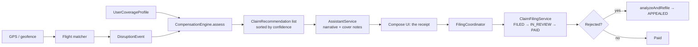
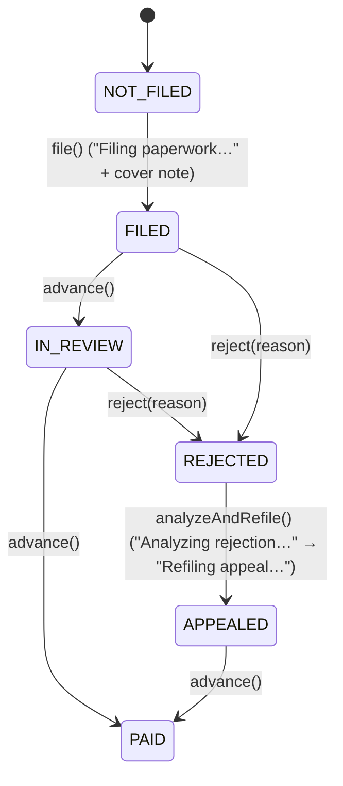

# Architecture

AeroDue is an **offline-first** Android app. Deterministic compensation rules
live in a pure Kotlin engine; an on-device LLM adds grounded narrative copy on
top; an optional MCP connector surface lets the user bring their own cloud model
or tools. A host-side Python package mirrors the rules for corpus work and parity
testing.

- [Modules](#modules)
- [Data flow: disruption → entitlements → filing → follow-up](#data-flow)
- [LLM fallback chain](#llm-fallback-chain)
- [Filing lifecycle](#filing-lifecycle)
- [Consent & telemetry](#consent--telemetry)
- [Plugins](#plugins)
- [Host parity](#host-parity)

## Modules

| Module | Path | Responsibility |
|--------|------|----------------|
| **core** | `android/core/` | Pure compensation rules: `CompensationEngine`, DOT/EU261 evaluators, credit-card / business-policy / airline-goodwill perks, domain models, GPS + flight-matcher stubs. No Android dependencies. |
| **app** | `android/app/` | Jetpack Compose / Material 3 UI (API 34), assistant facade, filing lifecycle + notifications, MCP connectors, consent store, plugins. |
| **llm** | `android/llm/` | LiteRT-LM 0.13 integration. `LlmRationaleRunner` interface, `LiteRtLlmRationaleRunner` (real, CPU backend), `RuleOnlyRationaleRunner` (deterministic fallback). |
| **backend** | `backend/aerodue/` | Host Python reference: CLI, YAML regulation corpus, parity tests with `core`. Not bundled into the APK. |

### Key app packages

- `assistant/` — `AssistantService`: LLM-backed filing notes, rejection analysis
  + appeal fixes, and optimal trip plans. Every method has a deterministic
  fallback so it works with no model installed.
- `filing/` — `ClaimFilingService` (lifecycle state) + `FilingCoordinator`
  (multi-phase orchestration) + `FilingNotifier` (system notifications).
- `mcp/` — connector framework (`McpModels`, `McpConnectorStore`,
  `McpConnectorRegistry`, `RemoteConnectorClient`). See [docs/MCP.md](MCP.md).
- `consent/` — `ConsentStore`: granular, opt-out-by-default GPS + telemetry consent.
- `notifications/` — `ClaimNotifier` (uses `POST_NOTIFICATIONS`).
- `plugins/` — `CompedPlugin` extension point (e.g. `PolymarketHedgePlugin`),
  under separate terms, disabled by default.

## Data flow

The product pipeline turns a detected disruption into a filed, tracked claim.



### Stage 1 — Detection

GPS/geofence signals (`core/location`) feed the flight matcher
(`core/flight`), producing a `DisruptionEvent` (`DELAY`, `CANCELLATION`,
`MISSED_CONNECTION`, `DENIED_BOARDING`, `BAGGAGE_DELAY`, `SCHEDULE_CHANGE`) with
`delayMinutes` and an `extraordinaryCircumstanceClaimed` flag.

### Stage 2 — Entitlements

`CompensationEngine.assess(event, profile, legDistanceKm)` stacks **independent**
sources and returns `ClaimRecommendation`s sorted by `confidence`:

```10:24:android/core/src/main/kotlin/com/aerodue/core/compensation/CompensationEngine.kt
object CompensationEngine {

    fun assess(
        event: DisruptionEvent,
        profile: UserCoverageProfile,
        legDistanceKm: Double = 2000.0,
    ): List<ClaimRecommendation> {
        val results = mutableListOf<ClaimRecommendation>()
        results += evaluateDotDelay(event, profile)
        results += evaluateEu261Delay(event, profile, legDistanceKm)
        results += creditCardClaims(event, profile)
        results += businessPolicyClaims(event, profile)
        results += airlineGoodwillClaims(event, profile)
        return results.sortedByDescending { it.confidence }
    }
```

Each `ClaimRecommendation` carries a `source`, `title`, `summary`,
`estimatedAmountUsd`, `currency`, `confidence`, `citationIds`, and `actionSteps`.
The stacked list *is* the "receipt." See
[docs/COMPENSATION_RULES.md](COMPENSATION_RULES.md) for the rule details.

### Stage 3 — Narrative

`AssistantService` enriches recommendations with passenger-facing text — a
grounded rationale, a one-line filing cover note, etc. The rules remain the
source of truth for eligibility and amounts; the LLM never invents figures.

### Stage 4 — Filing & follow-up

`FilingCoordinator` drives the multi-phase flow and surfaces progress to both the
UI and system notifications. See [Filing lifecycle](#filing-lifecycle).

## LLM fallback chain

Generation degrades gracefully so the app is fully usable with no model and no
network. `AssistantService.generateText` tries connectors first, then on-device:

```50:53:android/app/src/main/java/com/aerodue/app/assistant/AssistantService.kt
    private suspend fun generateText(prompt: String, system: String?): String {
        connectors?.generate(prompt, system)?.takeIf { it.isNotBlank() }?.let { return it }
        return llm.generate(prompt, system)
    }
```

```
1. Cloud model connector   (opt-in, off-device, user's own terms)  ── McpConnectorRegistry.generate
        │ null / disabled / failure
        ▼
2. On-device LiteRT-LM      (Qwen2.5-0.5B-Instruct, CPU, ~9s)       ── LiteRtLlmRationaleRunner
        │ "" when no model / generation fails
        ▼
3. Deterministic rules copy (RuleOnlyRationaleRunner + hardcoded fallback strings)
```

The active source is surfaced to the UI via `AssistantService.backendLabel`
(`"cloud · <name>"`, `"on-device LLM"`, or `"rules"`). The `llm.generate`
contract returns `""` when no model is available so callers can substitute their
deterministic copy.

## Filing lifecycle

`ClaimFilingService` is the state machine; `FilingCoordinator` orchestrates the
async, LLM-assisted phases and posts notifications via `FilingNotifier`.



Phase labels are constants on `FilingCoordinator`: `"Filing paperwork…"`,
`"Analyzing rejection…"`, `"Refiling appeal…"`. The user submits and confirms
each step — AeroDue prepares paperwork and tracks status, it does not act as a
legal representative.

## Consent & telemetry

`ConsentStore` keeps granular, **opt-out-by-default** state:

- `gpsTracking` — foreground/background GPS to auto-detect disruptions for free
  claims.
- `telemetrySharing` — share anonymized door-to-door telemetry that powers
  premium routing (the data flywheel).

Onboarding completes through `completeOnboarding(...)`, and each toggle can be
changed later. Nothing is shared until the user explicitly opts in.

## Plugins

`CompedPlugin` is a decoupled extension point. Plugins ship their **own** terms
(`externalEula`), are **never** auto-enabled, and require explicit EULA
acceptance to enable. The bundled `PolymarketHedgePlugin` is an inert stub (a
"later option") because real-money prediction markets implicate US CFTC + state
gambling law and are region-restricted — the architecture exists without
exposing core users to it.

## Host parity

`backend/aerodue/` mirrors the `core` rules in Python for regulation-corpus work
and CLI fixtures. Parity is checked with `pytest`:

```bash
cd backend && source .venv/bin/activate
python -m aerodue.cli assess --fixture samples/delayed_connection.json
pytest
```

When you change a rule in `android/core/`, change `backend/aerodue/core/` too (or
add a sync check) to keep the two in lock-step.

---

See also: [README](../README.md) · [MCP connectors](MCP.md) ·
[Compensation rules](COMPENSATION_RULES.md) · [Pitch](PITCH.md)
