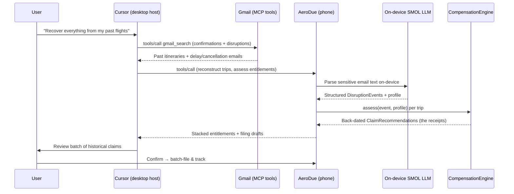

# MCP & Cloud Connectors

AeroDue runs on-device by default. The **connector framework**
(`android/app/.../mcp/`) lets a user plug their **own** cloud model or MCP service
into the assistant so the phone can participate in a larger AI assistant
framework. Connectors are **off by default**, persisted locally, and run under
the **provider's own terms** — enabling one sends data off-device.

- [Connector kinds](#connector-kinds)
- [Components](#components)
- [Adding a connector in-app](#adding-a-connector-in-app)
- [Wire formats](#wire-formats)
  - [Cloud model (OpenAI-compatible)](#cloud-model-openai-compatible)
  - [MCP tools (JSON-RPC 2.0)](#mcp-tools-json-rpc-20)
- [Routing & fallback](#routing--fallback)
- [Flagship flow: Cursor + Gmail historical filing](#flagship-flow-cursor--gmail-historical-filing)
- [Privacy & opt-in model](#privacy--opt-in-model)

## Connector kinds

`ConnectorKind` has two variants:

| Kind | Meaning | Wire protocol |
|------|---------|---------------|
| `CLOUD_MODEL` | Bring-your-own cloud model | OpenAI-compatible `chat/completions` |
| `MCP_TOOLS` | An MCP server exposing tools/resources | JSON-RPC 2.0 over HTTP (`initialize` + `tools/list` + `tools/call`) |

A connector is a small persisted record:

```19:30:android/app/src/main/java/com/aerodue/app/mcp/McpModels.kt
data class McpConnector(
    val id: String,
    val name: String,
    val kind: ConnectorKind,
    val endpointUrl: String,
    val authToken: String? = null,
    /** Model id for [ConnectorKind.CLOUD_MODEL], e.g. "gpt-4o-mini". */
    val modelId: String? = null,
    val enabled: Boolean = false,
    /** The provider's external terms must be accepted before enabling. */
    val termsAccepted: Boolean = false,
)
```

## Components

| Component | Role |
|-----------|------|
| `McpModels` | `ConnectorKind`, `McpConnector`, `RemoteTool`, `ConnectorProbe`. |
| `McpConnectorStore` | Persists connectors as a JSON array in DataStore (`aerodue_mcp_connectors`), using `org.json` only — no extra deps. |
| `McpConnectorRegistry` | Single source of truth (a `StateFlow<List<McpConnector>>`). `upsert`/`remove`, `setEnabled` (requires terms), `probe`, `generate`, and connector selection (`activeModelConnector`, `enabledToolConnectors`). |
| `RemoteConnectorClient` | Minimal-dependency I/O over `HttpURLConnection` + `org.json`. `probe`, `generate` (cloud), `callTool` (MCP), with SSE-framed-response tolerance. |

Everything uses `HttpURLConnection` + `org.json`, so the framework adds **no
third-party dependencies**.

## Adding a connector in-app

1. Open **Integrations** in the app.
2. Choose a kind — **Cloud model** (`CLOUD_MODEL`) or **MCP tools server**
   (`MCP_TOOLS`).
3. Enter the **endpoint URL**, an optional **bearer token**, and (for cloud
   models) a **model id** such as `gpt-4o-mini`.
4. **Probe** the connection. The client runs a capability check
   (`ConnectorProbe`): a 1-token `chat/completions` ping for cloud models, or
   `initialize` + `tools/list` for MCP servers (returning the discovered tools).
5. **Accept the provider's terms** and enable. `McpConnectorRegistry.setEnabled`
   only flips `enabled` to true if `termsAccepted` is set:

```40:46:android/app/src/main/java/com/aerodue/app/mcp/McpConnectorRegistry.kt
    suspend fun setEnabled(id: String, enabled: Boolean, termsAccepted: Boolean) {
        val next = _state.value.map {
            if (it.id != id) it
            else it.copy(enabled = enabled && termsAccepted, termsAccepted = it.termsAccepted || termsAccepted)
        }
        store.save(next)
    }
```

## Wire formats

### Cloud model (OpenAI-compatible)

Generation `POST`s a standard `chat/completions` body (temperature `0.3`,
optional `system` message) and reads `choices[0].message.content`:

```jsonc
// POST <endpointUrl>   Authorization: Bearer <token>
{
  "model": "gpt-4o-mini",
  "temperature": 0.3,
  "messages": [
    { "role": "system", "content": "You draft short, factual claim cover notes…" },
    { "role": "user",   "content": "Write one concise sentence a passenger can attach…" }
  ]
}
```

```jsonc
// 200 OK
{
  "choices": [
    { "message": { "role": "assistant", "content": "Requesting $480 under EU261…" } }
  ]
}
```

The probe sends the same shape with `max_tokens: 1` and a `"ping"` user message
to confirm reachability without spending tokens.

### MCP tools (JSON-RPC 2.0)

The client speaks MCP over HTTP (Streamable HTTP friendly: it tolerates both
plain JSON and `data:`-framed SSE responses, and forwards `Mcp-Session-Id`).

**1. `initialize`** establishes the session:

```jsonc
// POST <endpointUrl>   Accept: application/json, text/event-stream
{
  "jsonrpc": "2.0",
  "id": 1,
  "method": "initialize",
  "params": {
    "protocolVersion": "2024-11-05",
    "capabilities": {},
    "clientInfo": { "name": "AeroDue", "version": "0.1.0" }
  }
}
```

The response's `Mcp-Session-Id` header is captured and replayed on subsequent
calls.

**2. `tools/list`** discovers tools (rendered as `RemoteTool { name, description }`):

```jsonc
{ "jsonrpc": "2.0", "id": 2, "method": "tools/list", "params": {} }
```

**3. `tools/call`** invokes a tool; AeroDue joins the `content[].text` parts into
a single string:

```jsonc
{
  "jsonrpc": "2.0",
  "id": 2,
  "method": "tools/call",
  "params": {
    "name": "gmail_search",
    "arguments": { "query": "subject:(delay OR cancelled) flight" }
  }
}
```

```jsonc
// result
{
  "jsonrpc": "2.0",
  "id": 2,
  "result": {
    "content": [
      { "type": "text", "text": "Found 7 disruption emails from 2022–2024…" }
    ]
  }
}
```

## Routing & fallback

The assistant routes generation **cloud → on-device → rules**. The registry only
returns text when an enabled cloud-model connector exists; otherwise it returns
`null` so the caller falls back on-device:

```57:61:android/app/src/main/java/com/aerodue/app/mcp/McpConnectorRegistry.kt
    /** Route a generation to the active cloud model, or null to fall back on-device. */
    suspend fun generate(prompt: String, system: String?): String? {
        val connector = activeModelConnector() ?: return null
        return client.generate(connector, prompt, system)
    }
```

See the full chain in
[ARCHITECTURE.md → LLM fallback chain](ARCHITECTURE.md#llm-fallback-chain).

## Flagship flow: Cursor + Gmail historical filing

Because the phone runs a SMOL local LLM **and** exposes an MCP surface, it acts
as both an MCP **client** (consuming user-supplied cloud models/tools) and,
conceptually, an MCP-**addressable** assistant node. That makes a powerful
collaboration possible: a desktop agent and the phone's on-device agent work
together to recover money from **past** trips the user never claimed.

**Scenario:** A user has **Cursor** (or any MCP-capable host) connected to their
**Gmail**, and connects Cursor to the MCP exposed by/through **AeroDue on their
phone**.



**Steps:**

1. **Scan** — Cursor uses its Gmail tools to find historical flight
   confirmations and disruption emails.
2. **Reconstruct** — itineraries and disruptions are turned into
   `DisruptionEvent`s and a coverage profile. Sensitive parsing can stay
   on-device via the SMOL model.
3. **Compute** — `CompensationEngine.assess` runs per trip to produce back-dated,
   stacked entitlements (DOT + EU261 + card insurance).
4. **Batch-file & track** — the user confirms, and the filing lifecycle
   (`FilingCoordinator` / `ClaimFilingService`) files and follows up on each
   claim, recovering money never claimed.

## Privacy & opt-in model

- Connectors are **off by default**, configured explicitly, and require
  **accepting the provider's external terms** before they can be enabled.
- Enabling a connector **sends data off-device** under the provider's terms —
  this is the user's choice, not AeroDue's default.
- The **on-device SMOL model** can do sensitive parsing (e.g. email content)
  without leaving the phone; the cloud host is used **only where the user opts
  in**.
- Connector config is persisted **locally** in DataStore; AeroDue does not
  centralize it.

---

See also: [README](../README.md) · [Architecture](ARCHITECTURE.md) ·
[Compensation rules](COMPENSATION_RULES.md) · [Pitch](PITCH.md)
